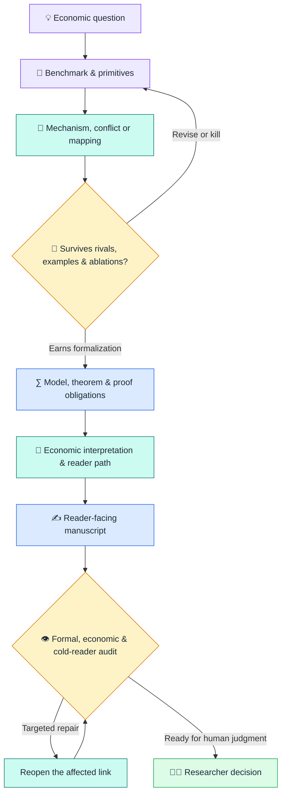
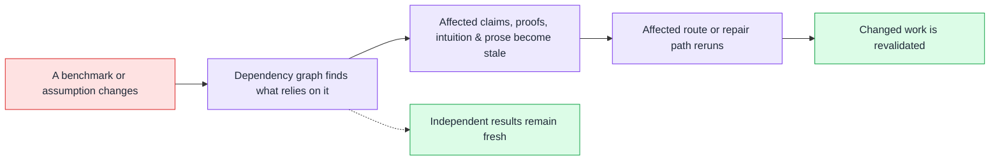

<div align="center">

# 🧠 Econ Theorist AI v2

### Turn a promising idea into an economic argument you can defend.

**Give AI a research process — not just a writing prompt.**

A mechanism-first operating system for pure and applied economic theory:
from question and benchmark to mechanism, theorem, intuition, manuscript, and revision.

Built to pursue the discipline expected in general-interest and leading field
theory — without pretending any workflow can promise publication.

<p>
  <a href="#-from-an-idea-to-a-defensible-argument-in-five-moves"></a>
  <a href="#-what-exists-today"></a>
  <a href="routes/registry.v8.json"></a>
  <a href="#-evidence-and-verification"></a>
  <a href="https://www.python.org/"></a>
  <a href="LICENSE"></a>
</p>

**The theorem must survive mathematics. The mechanism must survive economics.<br>
The exposition must survive a cold reader.**

**[See the five-step journey ↓](#-from-an-idea-to-a-defensible-argument-in-five-moves)**
&nbsp; · &nbsp;
**[Try the prepared preview ↓](#-try-the-prepared-public-codex-preview-in-three-steps)**

</div>

---

## 💸 The expensive part is not writing

A general-purpose model can make a draft look like a paper in minutes. That is
not the hard part of theory research.

The expensive part is discovering — thirty pages later — that the benchmark
was ill-defined, the supposed mechanism never changed a choice or equilibrium,
a true theorem carries the wrong intuition, or an elegant model has no clear
economic consequence. By then, notation, proofs, exposition, and positioning
are entangled. The researcher pays the hidden bill: reconstructing the
economics and rewriting the paper by hand.

> **A good theory paper is not a theorem wearing an introduction.**

Econ Theorist AI v2 is built to expose that research debt before it compounds.
A writing prompt helps produce the next page. V2 asks whether the economics
deserves the page.

## 🔗 V2 builds a chain of reasoning — not a pile of pages

V2 is not a prompt collection. It is an executable, versioned research
workflow built around the scientific commitments of a theory paper:

> **Question → Benchmark → Primitives → Mechanism → Predictions → Results →
> Intuition → Manuscript → Revision**

Each committed object is versioned and provenance-linked. Consequential
dependencies and promotion decisions are explicit, so later work cannot
silently redefine the accepted argument. Validators and review findings can
localize affected objects and identify which route must be reconsidered.

The manuscript is therefore an output of the research process — not a
substitute for it.

> [!NOTE]
> V2 is for **pure and applied economic theory**. It does not provide
> econometric, identification, estimation, data-analysis, or empirical-paper
> workflows. Numerical and formal tools are used only to discover, falsify, or
> verify theoretical claims.

## 🧭 From an idea to a defensible argument in five moves

### 1. Find the question worth carrying

Start from an economic puzzle and an exact benchmark. Clarify what the
benchmark explains, what it misses, why the answer matters, and what would kill
the project before months are invested in it.

**Outcome:** a sharply answerable research question with a meaningful
comparison and an explicit kill condition — not a topic looking for a model.

### 2. Make the economic logic visible

Decompose the primitives and identify the paper's result archetype. The
decisive economic logic need not be a comparative-static mechanism: it may be
an equilibrium feedback, the role of an axiom, the minimal conflict behind an
impossibility, or the mapping behind a representation. Solve the smallest
useful example and freeze predictions before the full derivation can rewrite
the original idea.

**Outcome:** economic logic that can be explained before it disappears inside
notation.

### 3. Try to kill the idea while it is still cheap to change

Run ablations, rival explanations or representations, boundary cases, and
counterexample searches. Weak stories should fail early. Claims are narrowed,
revised, or rejected according to what survives.

**Outcome:** an economic argument that has earned the cost of formalization.

### 4. Build the result with proof obligations and intuition attached

Compare formal implementations, state the theorem boundary, record proof
obligations, and audit the economic interpretation separately from proof
status and formal validity. Then turn the reviewed argument into the sequence
of questions a reader must understand.

**Outcome:** a result whose formal status and economic logic are explicit and
separately reviewable.

### 5. Write, test, and revise without losing the science

Turn the accepted argument into reader-facing manuscript units whose claims
remain linked to the economics behind them. Run separate formal-fidelity,
economic-reader, and cold-reader checks. When an assumption or claim changes,
reopen the affected proof, intuition, and prose while preserving independent
work.

**Outcome:** an argument that can evolve without losing the evidence,
boundaries, and decisions that support it.

Between these moves, the researcher explicitly decides whether to promote the
question and benchmarks, economic logic, formal base, central result, and
validated argument.



## 🚀 Try the prepared public Codex preview in three steps

**Target experience:** install once, then enable V2 in any paper project with
one sentence.

The prepared preview below is the first working slice of that experience. It
runs inside a cloned source checkout and initializes one public theory project
there. You do not need to learn route names, schemas, or state commands.

> [!CAUTION]
> The current Codex bridge is **public-only**. Use only public or deliberately
> synthetic research content. This preview has demonstrated one natural-language
> handoff into a route-valid canonical commit. A later V8 blind run committed
> framing and decomposition but exhausted its repair budget without an audit
> commit. A later developer-assisted, nonblind Scheme-B follow-up did commit an
> unchanged-V8 audit, but that audit still requires a framing revision and no G1
> decision occurred; a fresh WorkPacket-only audit and a complete paper run
> remain unproved. Clean first-use activation in an arbitrary paper directory,
> positive
> private execution, and Claude Code/Cursor parity also remain pending.

### Before you start

You need [Git](https://git-scm.com/), [Python 3.11+](https://www.python.org/),
and Codex.

### 1. Prepare the checkout — first time only

```bash
git clone https://github.com/viplee110/econ-theorist-ai-v2.git
cd econ-theorist-ai-v2
python --version
python -m venv .venv
```

The reported version must be 3.11 or newer. On Windows, if `python` is
unavailable but the Python launcher is installed, use `py -3` in those two
commands. On macOS or Linux, use `python3` if `python` is unavailable.

Install and check the engine without activating the environment:

```powershell
# Windows PowerShell
.\.venv\Scripts\python.exe -m pip install -e .
.\.venv\Scripts\etai.exe doctor
```

```bash
# macOS / Linux
./.venv/bin/python -m pip install -e .
./.venv/bin/etai doctor
```

The checkout is ready when `doctor` reports `"required_ok": true`.

### 2. Open the exact cloned root in Codex

Open the `econ-theorist-ai-v2` directory itself — the folder containing
`.agents`, `pyproject.toml`, and this README.

### 3. Paste one safe public instruction

```text
Use $econ-theorist-v2 in this exact repository root. Initialize a public theory
project called "My Theory Project" and complete only the first engine-selected
framing route. Research question: [a public or deliberately synthetic economic
question]. Stop after the first route-valid canonical commit or whenever my
judgment is required. Do not continue to another route.
```

<details>
<summary><strong>Ready-to-paste public demo</strong></summary>

```text
Use $econ-theorist-v2 in this exact repository root. Initialize a public theory
project called "Consumable Quality Certificates" and complete only the first
engine-selected framing route. Ask whether lowering the cost of a truthful but
consumable quality certificate can reduce buyer search by changing the
composition of the uncertified pool. Stop after the first route-valid canonical
commit or whenever my judgment is required. Do not continue to another route.
```

This synthetic question is adapted from the repository's recorded public
Codex pilot.

</details>

### What happens after you press Enter

1. V2 reads the current scientific state.
2. It selects the next legal, bounded research task.
3. It gives the model only the context needed for that task.
4. It applies the selected route's schema, domain, lineage, freshness,
   project-policy, and authority validators.
5. It commits only validator-accepted state, preserves disclosed failures, and
   pauses at substantive human gates.

<details>
<summary><strong>Direct terminal path</strong></summary>

```bash
etai --project /path/to/paper init --name "My theory project"
etai --project /path/to/paper validate
etai --project /path/to/paper status
etai --project /path/to/paper begin frame.question_and_benchmarks
```

The machine protocol and Codex bridge remain the preferred host-facing
interfaces. The lower-level commands exist for testing, automation,
inspection, and recovery — not as a second scientific workflow.

</details>

## ⚡ What changes when AI works inside a research system

| Research task | Risk in an unstructured AI session | V2 control |
|---|---|---|
| **Where research begins** | Drafting starts before the benchmark is fixed | Require a question, exact benchmark, and kill condition |
| **How an idea earns formalization** | Plausibility is mistaken for evidence | Run rivals, examples, ablations, and counterexamples first |
| **How results are judged** | Proof status and intuition are blended | Review formal validity and economic interpretation separately |
| **What the system remembers** | Decisions disappear into the conversation | Preserve versioned decisions, predictions, claims, and dependencies |
| **What happens after a revision** | Broad regeneration hides what changed | Invalidate, repair, and revalidate exact dependents |
| **Who controls the science** | Core choices drift inside the chat | Reserve structural decisions for the researcher |

> **The AI may propose. The validators may reject. Only the researcher can
> promote a structural scientific decision.**

## 🧠 Research history should compound — not disappear into chat

**Chat threads accumulate words. V2 accumulates research state.**

Accepted benchmarks remain visible. Failed predictions are not erased.
Theorem boundaries travel with their claims. Human decisions remain visible
and govern later work until explicitly superseded. Reviewer objections can be
traced to the objects they challenge. Revisions preserve work that is still
valid.

The goal is not to replace the economist's judgment. It is to make that
judgment compound instead of evaporating at the end of every session.

## ♻️ Change one assumption. Keep everything that still holds.

Suppose a researcher changes a search-cost benchmark. Some comparative
statics, proofs, interpretations, and manuscript paragraphs may depend on that
benchmark. An independent lemma may not.

V2 records those dependencies explicitly. When the dependency structure
permits, it marks only the affected facets and objects as stale, sends that path
through repair and fresh review, and leaves independent results available.



This is **selective scientific revision**, not cosmetic editing. V2's central
efficiency hypothesis is that more exact diagnosis early can mean less
reconstruction and less human rewriting later. Phase 6 will test that
hypothesis against V1 using model tokens, machine time, revision scope, and
active researcher effort.

## 🏛️ Built for ambition. Measured with humility.

Top-journal ambition is not a style prompt. It is a higher burden of argument.
At that standard, correctness is only the floor. A paper needs a consequential
question or conceptual update; archetype-appropriate economic logic that
survives serious alternatives; intuition that lets a reader reconstruct the
result; and exposition that carries the central insight to a nearby case.

V2 represents those burdens through explicit scientific gates, review routes,
and audience profiles. Profiles can change emphasis, never the correctness
floor. V2 does not imitate Econometrica prose or dress a field contribution in
general-interest rhetoric.

**Top-journal ambition is the target. Evidence decides whether the system is
getting closer.**

## 🚦 What exists today

### Implemented in the current engine

- ✅ Typed, versioned research state with immutable transactions and replay
- ✅ Thirty-five enabled, bounded research routes
- ✅ Deterministic scientific, lineage, freshness, privacy, and authority checks
- ✅ Human G1–G5 promotion gates; no external-release route is enabled, and any
  future release remains L3 human-controlled
- ✅ Dependency-driven invalidation and bounded repair/revision routes
- ✅ Exact-bound `reframe.repair` recovery for an untouched, empty-focus
  framing-v2 run; activated-team `kill`/`new_brief_required` recovery remains
  open
- ✅ Paper IR and manuscript-unit routes with formal-fidelity, economic-reader,
  cold-reader, and profile/craft review
- ✅ V8 pre-G1 framing-quality audit passing its deterministic acceptance suite

### Recorded public pilot evidence

- ✅ One recorded public Codex handoff from a natural-language question to a
  canonical, route-valid `frame.question_and_benchmarks` commit
- ✅ One later public blind run with canonical framing and primitive-decomposition
  commits, an honestly negative audit candidate, and no fabricated G1 decision
- ✅ One recorded framing-team pilot whose host/operational evidence binds a
  mentor, two attributed collaborators, one natural-language researcher
  synthesis, and one worker completion chain to a canonical framing commit; the
  exact [engine/wheel/model-bound verdicts](review_outputs/phase5b0_framing_team_public_pilot/evaluation_summary.md)
  are M `PASS`, T `MIXED`, U not established, and Q `MIXED`, so this is
  source-aware machine-path evidence rather than provider-independent delivery,
  multi-agent, usability, or quality evidence
- ✅ One frozen noncanonical probe returned `PARK` (0.95), followed by the
  researcher's Scheme-B choice and a developer-assisted, nonblind canonical
  checkpoint at `aea3e7...`, then explicit authorization to replace strict
  `frontier` with an outcome-vector comparison/locus without capacity or
  optimization. A clean strict-validator continuation ends at
  `bf4e7fdd49bcf089b18318e77075514cbaea027939049113d1d5840073b4800c`,
  replays successfully, and proposes `ready_for_g1` without confirming G1;
  the exact [follow-up evidence boundary](review_outputs/phase5b0_framing_team_public_pilot_followup/FOLLOWUP_SUMMARY.md)
  records why this is not fresh model or research-quality evidence

### Still being tested or built

- 🧪 Independent economics/editing-burden inspection and an explicit human G1
  review; another held-out V1/V2 comparison only if a concrete
  researcher-facing failure makes it decision-relevant
- 🧪 Comparative readability, token, wall-time, and active-human-effort gains
- 🧪 A later genuinely unscripted user-choice pilot
- 🚧 Clean first-use installation and positive private execution
- 🚧 Claude Code and Cursor host parity
- ⏳ End-to-end human–AI paper development at the intended quality bar

> [!IMPORTANT]
> Econ Theorist AI v2 is an experimental research system — not an autonomous
> economist, a truth oracle, or a publication guarantee. It can enforce a more
> disciplined and traceable process; novelty, economic judgment, correctness,
> authorship, and submission responsibility remain with the researchers.

## 🧩 Technical depth

<details>
<summary><strong>How the engine is organized</strong></summary>

| Layer | Purpose |
|---|---|
| **Typed research state** | Questions, benchmarks, primitives, mechanisms, claims, proofs, interpretations, and manuscript units have exact schemas and versions. |
| **Route engine** | Thirty-five bounded routes select only the context and authority needed for the next task. |
| **Scientific validators** | Schema validity is not enough: economics, lineage, freshness, privacy, and authority are checked before commit. |
| **Immutable history** | Accepted transactions can be replayed; superseded decisions remain visible instead of being rewritten. |
| **Human gates** | AI may explore provisionally, while structural research choices and submission remain human-owned. |
| **Bounded manuscript compiler** | Validated argument objects feed Paper IR, reader paths, manuscript units, and independent review. |

The current V8 pre-G1 path is:

```text
frame.question_and_benchmarks
→ decompose.primitives
→ audit.framing_economics
→ human G1 decision
```

</details>

<details>
<summary><strong>Project map and architecture documents</strong></summary>

```text
econ-theorist-ai-v2/
├── .agents/skills/        Thin host projection for the prepared Codex path
├── routes/                Versioned research routes and instructions
├── schemas/               Canonical scientific and machine contracts
├── src/econ_theorist/     State kernel, validators, CLI, and machine facade
├── profiles/              Audience and ambition profiles
├── craft/                 Function-first exposition resources
├── docs/                  Architecture, contracts, evaluation, and walkthroughs
├── review_outputs/        Recorded pilot and diagnostic evidence
└── tests/                 Positive, negative, adversarial, and replay checks
```

- [Architecture and constitution](ARCHITECTURE.md)
- [Positive theory research kernel](docs/architecture/theory_kernel.md)
- [State and runtime architecture](docs/architecture/state_runtime.md)
- [Theory manuscript compiler](docs/architecture/manuscript_compiler.md)
- [Evaluation protocol](docs/architecture/evaluation.md)
- [Implementation plan](docs/architecture/implementation_plan.md)
- [Host bootstrap and natural-language onboarding](docs/implementation/phase5a_contract.md)
- [V8 framing-quality preflight](docs/implementation/framing_quality_contract.md)
- [V1 capability migration](docs/architecture/v1_migration.md)

</details>

## 🧪 Evidence and verification

The pre-pilot V8 deterministic checkpoint ran **584 routine non-long tests** with six
platform/optional skips. The focused framing suite passed **69 tests**, and the
Windows operational-journal regression passed **25 tests**. Python compilation
and diff checks also passed. The seven schema/resource exporters and an
installed-wheel `doctor` check passed for the V8 pilot freeze. The first blind
run later committed framing and decomposition but not the audit. One leading
JSON/encoding failure and an incomplete domain diagnostic reduced repair
usability, while the final candidate also contained three real primitive-path
errors and was correctly rejected. The post-pilot stabilization was not
exercised by that run, so neither checkpoint establishes better papers or lower
human editing effort.
See the [V8 run report](review_outputs/phase5a2_v8_codex_public_pilot/run_report.md).

The bounded post-pilot host-stabilization checkpoint then passed **594 routine
non-long tests** with the same six declared skips, including **65 affected-route
tests**. All seven exporters and the required `doctor` checks passed. This
proves deterministic compatibility of the source candidate, not real-model
success; the [stabilization gate](review_outputs/phase5a2_v8_codex_public_pilot/stabilization_gate.md)
keeps the next blind-run and economics evidence separate.

The later Phase 5B follow-up is recorded separately from both checkpoints. Its
source-isolated nondegeneracy probe returned `PARK` with confidence 0.95; the
researcher then selected a score-blind rule strictly increasing in the review
signal, with `phi(s,r)=r` as the minimal baseline. Developer-assisted, nonblind
candidates canonically committed the corresponding repair, decomposition
refresh, and unchanged-V8 audit at checkpoint head `aea3e7...`. The researcher
then authorized the exact outcome-vector/locus terminology repair without
capacity or optimization. A separate strict-replay recovery reaches
`bf4e7fdd...4800c`; its fresh V8 audit proposes `ready_for_g1`, but no human G1
decision occurred.
The [follow-up archive](review_outputs/phase5b0_framing_team_public_pilot_followup/FOLLOWUP_SUMMARY.md)
records the partial dirty-source binding, the rejected experimental lineage,
and the developer-assisted/nonblind boundary of the valid recovery.

<details>
<summary><strong>Show verification commands</strong></summary>

```bash
python scripts/run_non_long_tests.py
python scripts/export_schemas.py --check
python scripts/export_theory_schemas.py --check
python scripts/export_authoring_schemas.py --check
python scripts/export_profile_craft_schemas.py --check
python scripts/export_profile_craft_resources.py --check
python scripts/export_machine_schemas.py --check
python scripts/export_framing_quality_schemas.py --check
```

The raw `unittest` discovery command also runs the three hour-scale Phase 2–4
gold chains. Use it only when that expensive full-history replay is intended.

</details>

## ⚖️ License and citation

Econ Theorist AI v2 is licensed under the
[Apache License 2.0](LICENSE). Attribution and citation metadata are available
in [CITATION.cff](CITATION.cff).

© 2026 viplee110. Built for rigorous, readable economic theory.
