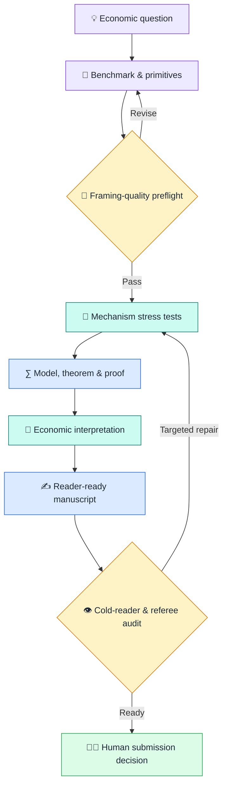
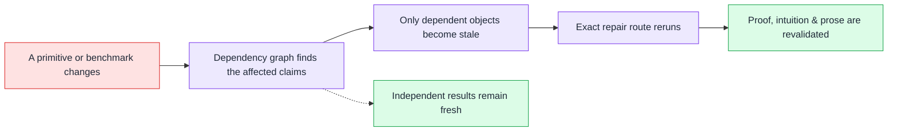

<div align="center">

# 🧠 Econ Theorist AI v2

### A mechanism-first research operating system for economic theory

**From a sharp question to a traceable, testable, reader-ready argument.**

<p>
  <a href="#-what-it-does"></a>
  <a href="#-current-status"></a>
  <a href="routes/registry.v5.json"></a>
  <a href="#-verification"></a>
  <a href="https://www.python.org/"></a>
  <a href="LICENSE"></a>
</p>

**Mechanism first · Formal rigor · Intuition throughout.**

Built to pursue general-interest and leading field-journal standards — never to promise publication.

**[Start the prepared public preview →](#-quick-start)**

</div>

---

## 🎯 Why V2 exists

> **A good theory paper is not a theorem wearing an introduction.**

Many AI paper workflows start writing too soon. They turn a loose idea into
notation, find a tractable result, and attach generic intuition afterward. The
output can be mathematically polished yet economically abstract, difficult to
read, and expensive for a researcher to repair.

Econ Theorist AI v2 reverses that sequence. Before a result is treated as
paper-ready, the workflow asks for the benchmark, primitives, the behavioral or
equilibrium response that actually moves, the economic force or forces, causal
chain, falsification tests, theorem boundary, and reader-facing intuition.

The result is more than generated prose: it is a versioned research process in
which questions, assumptions, claims, proofs, interpretations, revisions, and
human decisions remain traceable.

> [!NOTE]
> V2 is for **pure and applied economic theory**. It does not provide
> econometric, identification, estimation, data-analysis, or empirical-paper
> workflows. Numerical and formal tools are used only to discover, falsify, or
> verify theoretical claims.

## ✨ What it does

- 🧭 **Frames the economics** — pins down the question, benchmark, primitives,
  and the behavioral or equilibrium response that drives the result; then
  checks what each benchmark truly holds fixed.
- 🧪 **Falsifies early** — uses hand-solvable examples, ablations, rival
  mechanisms, and counterexamples before expensive formalization.
- ∑ **Builds trustworthy results** — links assumptions, theorem statements,
  proof obligations, verification evidence, interpretation, and boundaries.
- 💬 **Makes intuition readable and auditable** — important explanations must
  let a reader recover the benchmark, force, causal chain, and nearby cases;
  manuscript claims remain connected to the validated economics.
- 🔁 **Repairs selectively** — a revision invalidates only its real dependents
  instead of silently regenerating the entire paper.
- 🧑‍🔬 **Keeps researchers in control** — structural scientific choices remain
  human-controlled; external release, submission, and destructive actions
  require explicit authorization.

## 🗺️ How the research route works



The current V5 pre-G1 path is deliberately concrete:

```text
frame.question_and_benchmarks
→ decompose.primitives
→ audit.framing_economics
→ human G1 decision
```

Only a human can promote the central question and benchmarks. Later gates do
the same for the mechanism, formal base, main result, and argument spine;
external release remains a separate human-only action.

## 🚀 Quick start

### Prepared public preview — Codex checkout

#### 1. Set up the checkout

```bash
git clone https://github.com/viplee110/econ-theorist-ai-v2.git
cd econ-theorist-ai-v2
python -m venv .venv
```

Activate the environment:

```powershell
# Windows PowerShell
.\.venv\Scripts\Activate.ps1
```

```bash
# macOS / Linux
source .venv/bin/activate
```

Then install and check the engine:

```bash
python -m pip install -e .
etai doctor
```

#### 2. Open the checkout in Codex

#### 3. Say this

```text
Use $econ-theorist-v2 in this repository.

Initialize a public theory project named "My Theory Project" and study this
question: [describe the economic problem].

Target [general-interest theory / a leading field journal]. Stop at every
substantive human decision gate.
```

Codex uses the repository's thin project skill and the engine-owned
`etai codex invoke` bridge in the background. The engine chooses the legal next
research task, supplies only the relevant context, validates the result, and
records only accepted scientific state.

> [!CAUTION]
> The current Codex bridge is **public-only**. Do not provide non-public research
> content through it. Clean first-use installation, positive private execution,
> and Claude Code/Cursor parity remain pending.

<details>
<summary><strong>Direct terminal path</strong></summary>

After installing the package, initialize a paper directory explicitly:

```bash
etai --project /path/to/paper init --name "My theory project"
etai --project /path/to/paper validate
etai --project /path/to/paper status
```

Advanced users can open the first route directly:

```bash
etai --project /path/to/paper begin frame.question_and_benchmarks
```

The machine protocol and Codex bridge remain the preferred hosted interfaces.
The lower-level `begin`, `stage`, `commit`, `decide`, `stale`, and `recover`
commands exist for testing, automation, inspection, and recovery — not as a
second scientific workflow.

</details>

## 🔁 Why revisions do not become full rewrites

Every important object carries an exact version and dependency lineage. When a
benchmark, primitive, assumption, or claim changes, V2 derives the smallest
affected subgraph and sends only that material back through repair and review.



This is the central efficiency bet of V2: spend machine effort early on exact
diagnosis and validation so that researchers spend less time reconstructing
the argument or rewriting unaffected parts later. The comparative human-effort
claim remains to be tested in Phase 6.

## 🧩 What sits under the hood

| Layer | Purpose |
|---|---|
| **Typed research state** | Questions, benchmarks, primitives, mechanisms, claims, proofs, interpretations, and manuscript units have exact schemas and versions. |
| **Route engine** | Thirty-five bounded routes select only the context and authority needed for the next task. |
| **Scientific validators** | Schema validity is not enough: economics, lineage, freshness, privacy, and authority are checked before commit. |
| **Immutable history** | Accepted transactions can be replayed; superseded decisions remain visible instead of being rewritten. |
| **Human gates** | AI may explore provisionally, while structural research choices and submission remain human-owned. |
| **Bounded manuscript compiler** | Validated argument objects feed Paper IR, reader paths, manuscript units, and independent review. |

## 🚦 Current status

- ✅ Deterministic scientific-state kernel and accepted Phase 1–4 routes
- ✅ IDE-neutral machine protocol and local machine facade
- ✅ Recorded public Codex route from natural language to a validated research-state commit
- ✅ V5 framing-quality preflight passes deterministic acceptance
- ✅ Thirty-five enabled routes and seven checked schema/resource exporters
- 🧪 Fresh real-model V5 pilot and held-out V1/V2 comparison pending
- 🚧 Clean first-use installer, positive private execution, and broader IDE
  adapters pending
- ⏳ Complete autonomous paper generation and lower human effort not yet
  demonstrated

The latest deterministic V5 checkpoint completed **522 routine non-long tests**
with six platform/optional skips. After the final independent review repair,
the affected framing-quality route suite passed **14/14**.

> [!IMPORTANT]
> Econ Theorist AI v2 is an experimental research system — not an autonomous
> economist, a truth oracle, or a publication guarantee. It can enforce a more
> disciplined and traceable process; novelty, economic judgment, correctness,
> authorship, and submission responsibility remain with the researchers.

## 📁 Project map

```text
econ-theorist-ai-v2/
├── .agents/skills/        Thin host projection for the prepared Codex path
├── routes/                Versioned research routes and instructions
├── schemas/               Canonical scientific and machine contracts
├── src/econ_theorist/     State kernel, validators, CLI, and machine facade
├── profiles/              Audience and ambition profiles
├── craft/                 Function-first exposition resources
├── docs/                  Architecture, contracts, evaluation, and walkthroughs
├── review_outputs/        Recorded pilot and diagnostic evidence
└── tests/                 Positive, negative, adversarial, and replay checks
```

## 📚 Start with these documents

- [Architecture and constitution](ARCHITECTURE.md)
- [Positive theory research kernel](docs/architecture/theory_kernel.md)
- [State and runtime architecture](docs/architecture/state_runtime.md)
- [Theory manuscript compiler](docs/architecture/manuscript_compiler.md)
- [Evaluation protocol](docs/architecture/evaluation.md)
- [Implementation plan](docs/architecture/implementation_plan.md)
- [Host bootstrap and natural-language onboarding](docs/implementation/phase5a_contract.md)
- [V5 framing-quality preflight](docs/implementation/framing_quality_contract.md)
- [V1 capability migration](docs/architecture/v1_migration.md)

## 🧪 Verification

<details>
<summary><strong>Show verification commands</strong></summary>

Run the routine deterministic suite:

```bash
python scripts/run_non_long_tests.py
```

Verify every generated schema and packaged resource:

```bash
python scripts/export_schemas.py --check
python scripts/export_theory_schemas.py --check
python scripts/export_authoring_schemas.py --check
python scripts/export_profile_craft_schemas.py --check
python scripts/export_profile_craft_resources.py --check
python scripts/export_machine_schemas.py --check
python scripts/export_framing_quality_schemas.py --check
```

The raw `unittest` discovery command also runs the three hour-scale Phase 2–4
gold chains. Use it only when that expensive full-history replay is intended.

</details>

## ⚖️ License and citation

Econ Theorist AI v2 is licensed under the
[Apache License 2.0](LICENSE). Attribution and citation metadata are available
in [CITATION.cff](CITATION.cff).

© 2026 viplee110. Built for rigorous, readable economic theory.
