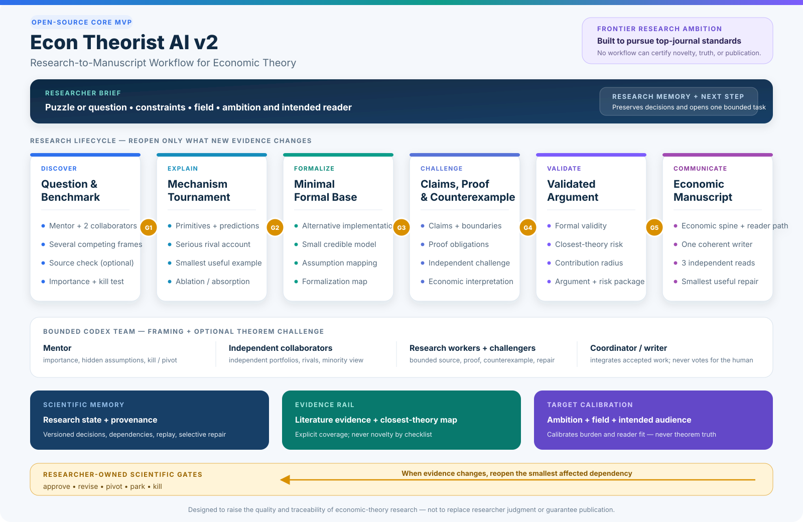

<div align="center">

# 🧠 Econ Theorist AI v2

### Your AI research team for economic theory

**Bring an economic puzzle. Discuss the research choices in ordinary language.**

Econ Theorist AI v2 helps a researcher move from a promising question to a
defensible economic argument, formal results, and a readable manuscript—while
keeping the consequential scientific decisions in human hands.

Built for the standards of general-interest and leading field theory, without
pretending that any workflow can guarantee publication.

<p>
  <a href="#start-here"></a>
  <a href="#what-is-ready-today"></a>
  <a href="#designed-to-raise-top-journal-potential"></a>
  <a href="LICENSE"></a>
</p>

**The theorem must survive mathematics. The mechanism must survive economics.<br>
The exposition must survive a cold reader.**

</div>

| You bring | The AI team helps | You decide |
|---|---|---|
| An economic puzzle, constraints, and intended audience | Compare questions, expose mechanisms, attack arguments, derive results, and revise prose | The question, model, central claims, contribution, paper argument, and submission |

> [!NOTE]
> V2 is for **pure and applied economic theory**. It does not provide
> econometric, identification, estimation, data-analysis, or empirical-paper
> workflows. Numerical and formal tools may support theoretical discovery and
> verification, but finite computation is never treated as a universal proof.

## Start here

The current **broadest and publicly exercised preview is in Codex**, including
the bounded framing team. Claude Code and Cursor include thin adapters to the
same single-route engine, but native end-to-end runs and multi-agent parity have
not yet been validated. None of the three asks you to manage schemas, object
IDs, or JSON.

> [!CAUTION]
> Treat the current adapters as **public-only** until private execution has
> been positively validated. Begin with a public or deliberately synthetic
> question. Do not paste an unpublished idea, confidential draft, private
> referee report, or proprietary material into this path.

### 1. Install once

You need [Git](https://git-scm.com/), [Python 3.11+](https://www.python.org/),
and one supported AI coding environment.

```bash
git clone https://github.com/viplee110/econ-theorist-ai-v2.git
cd econ-theorist-ai-v2
python -m venv .venv
```

Install and check the engine without activating the environment:

```powershell
# Windows PowerShell
.\.venv\Scripts\python.exe -m pip install -e .
.\.venv\Scripts\etai.exe doctor
```

```bash
# macOS / Linux
./.venv/bin/python -m pip install -e .
./.venv/bin/etai doctor
```

The installation is ready when `doctor` reports `"required_ok": true`.

### 2. Choose a host

| Host | What works today | Recommendation |
|---|---|---|
| **Codex** | Prepared public natural-language skill and bounded multi-agent bridge | Recommended; the only host with recorded public route execution today |
| **Claude Code** | Root [`CLAUDE.md`](CLAUDE.md) adapter targeting the host-neutral single-route protocol | Adapter provided; native host smoke and multi-agent parity remain unverified |
| **Cursor** | [Project rule](.cursor/rules/econ-theorist-v2.mdc) targeting the same single-route protocol | Adapter provided; native host smoke and multi-agent parity remain unverified |

For Claude Code or Cursor, open the same repository root and explicitly ask it
to use the repository's Econ Theorist AI v2 adapter. Use Codex today when the
framing or theorem-challenge team is important.

### 3. Paste one instruction

```text
Use this repository's Econ Theorist AI v2 adapter in this exact repository
root. In Codex, use $econ-theorist-v2; in Claude Code, follow CLAUDE.md; in
Cursor, follow the project rule. Initialize a public theory project called
"My Theory Project".

The economic puzzle I want to explore is: [describe it in ordinary language].
Intended audience and ambition: [Econometrica / general-interest Top-5 /
leading field journal / undecided].

Start by helping me find and compare consequential, tractable questions. Use
the mentor and collaborators when the engine makes that team available.
Compare each serious direction with an exact benchmark, pressure-test its
potential contribution, and state what literature has and has not been
checked. Do not choose a model or draft a paper before I approve the framing.
Stop whenever my judgment is required.
```

### 4. Continue in ordinary language

```text
I prefer direction B, but use the benchmark from A.
Revise both directions around this objection: ...
Park this question and explain why.
Continue with v2.
```

The system should translate those choices into the next bounded research task.
It should not ask you to maintain its internal bookkeeping. This is normally a
**multi-round research conversation**, not a one-shot idea generator. You may
challenge, combine, revise, or reject proposals at each scientific decision;
the system then continues from the accepted research state.

### What happens next

1. V2 reads the current research state rather than relying on chat memory.
2. It selects the next legal research task and gives the model only the context
   needed for that task.
3. On the available team surfaces, a mentor and independent collaborators
   compare genuinely different directions before one worker receives a handoff.
4. The engine validates the proposed research objects before accepting them.
5. V2 pauses at the scientific decisions that belong to you: approve, revise,
   pivot, park, or kill.

## Why this is different from an ordinary AI writing session

A general-purpose model can produce pages quickly. The expensive failures in
theory research usually happen earlier: the benchmark is wrong, the proposed
mechanism changes nothing, a theorem is true for the wrong intuition, the
closest literature absorbs the contribution, or a formally correct result has
no important economic consequence.

V2 organizes the work around those risks.

| Research problem | What V2 does | What the researcher sees |
|---|---|---|
| A topic is mistaken for a research question | Requires an exact benchmark, contribution hypothesis, and kill condition | A small set of contestable questions rather than a model chosen too early |
| Formalism outruns the economics | Freezes primitives, predictions, rivals, and a minimal example before general derivation | The operative economic force in plain language |
| A plausible result is treated as established | Separates proof, counterexample, boundary, and economic-interpretation work | Exact proof status and unresolved obligations |
| Novelty is asserted from memory | Records literature evidence, closest-theory comparisons, and absorption risk | A bounded contribution claim with visible coverage limits |
| Revision becomes a full rewrite | Tracks dependencies among assumptions, claims, proofs, intuition, and prose | Only the affected research path is reopened |
| AI quietly takes over scientific judgment | Reserves structural promotion and external release for the researcher | Clear approve / revise / pivot / park / kill decisions |

> **A good theory paper is not a theorem wearing an introduction.**

The manuscript is therefore an output of the research process—not a substitute
for it.

## How the research develops

The workflow is a chain of scientific commitments, not a waterfall. A changed
assumption, failed proof, new paper, or better benchmark can reopen the smallest
affected part without erasing valid work.

<p align="center">
  
</p>

| Stage | Central question | Main output | Human decision |
|---|---|---|---|
| **1. Question and benchmark** | What exactly is unexplained, why might it matter, and what would kill the project? | Research question, benchmark set, contribution hypothesis | **G1:** pursue, revise, pivot, park, or kill |
| **2. Economic mechanism** | Which primitive, conflict, equilibrium feedback, mapping, or impossibility force changes the answer? | Competing mechanisms, frozen predictions, minimal examples | **G2:** promote the economic logic |
| **3. Formal base** | What is the smallest credible model that represents that logic? | Formalization map, assumptions, solution concept, proof obligations | **G3:** promote the formal base |
| **4. Claims and challenge** | Which results survive proof attempts, counterexamples, boundaries, and interpretation checks? | Verified claims, counterexamples, interpretation audit | **G4:** invest in the result portfolio |
| **5. Validated argument** | What has actually been learned, and what can the closest theory already explain? | Argument package, contribution boundary, risks and limitations | **G5:** promote the argument |
| **6. Economic manuscript** | Can a reader reconstruct the question, mechanism, result, and consequence? | Paper IR, reader path, manuscript units, targeted revisions | Researcher-owned manuscript promotion and release |

## A research team when it helps

V2 does not summon an agent swarm for every task. It uses the smallest team
whose independence can improve the science:

- The **mentor** attacks importance, hidden assumptions, and the decision to
  continue, simplify, pivot, park, or kill.
- Two **independent collaborators**, kept separate before synthesis, compare
  three to five candidate frames and expose a champion, a serious runner-up,
  and a short rejection ledger.
- A **research worker** executes the selected bounded task after the
  researcher's choice.
- On the post-G3 verification route, an optional **proof worker** and
  **counterexample/economics challenger** attack the same proof obligations
  independently.
- One **coordinator and writer** integrates accepted work into the persistent
  project record. Agent agreement is advice, not proof or human approval.

Current team surfaces are deliberately bounded: framing and an optional theorem
challenge. Other stages use one research agent. The exact contracts are documented
in the [framing-team contract](docs/implementation/phase5b_framing_team_contract.md)
and [theorem-team contract](docs/implementation/phase5b_theorem_team_contract.md).

## Designed to raise top-journal potential

Top-journal ambition is not a request for grander prose or more mathematics. It
is a higher burden of economic argument. V2 is designed to pressure-test five
conditions that strong general-interest and field-leading theory usually need:

1. **A consequential question.** The result changes how economists understand
   an important class of environments, not merely one parameterization.
2. **A distinct economic force.** The load-bearing mechanism, conflict,
   representation, or impossibility is reconstructible and survives a serious
   rival explanation.
3. **A contribution that is not absorbed.** The closest theory, natural
   benchmark, and simpler implementation cannot already deliver the same lesson.
4. **Formal validity with economic interpretation.** Proof status, assumptions,
   boundaries, intuition, and near-transfer predictions are checked separately.
5. **Reader transmission.** A nearby economist can understand what changed,
   why it changed, and where the result stops.

These are necessary pressures, not a publication formula. V2 is designed to
improve the discipline and search process; editors, referees, the literature,
and the actual economics determine whether a paper reaches a Top-5 or
leading-field standard.

### You may name a target journal on day one

The first research brief may say **Econometrica**, **general-interest Top-5**,
**frontier theory**, **leading field journal**, or another intended venue. The
target calibrates ambition, comparison burden, audience, exposition, and review
pressure. It may never change theorem truth, assumptions, proof status, actual
novelty, economic scope, or publication probability.

The current catalog does not ship an active named-journal overlay. An
Econometrica request therefore selects or proposes a supported ambition and
audience profile such as `frontier_general_interest` or `frontier_theory`; the
system must not invent “Econometrica rules” or imitate journal prose. The
[profile and craft architecture](docs/architecture/profiles_and_craft.md)
explains this separation.

## What is ready today

The open-source v1.0 core on `main` is ready for researcher-supervised use in
the prepared Codex checkout. “v1.0 core” means the research chain is available
as a coherent public release; it does not mean every host integration or
research-quality claim has been proved.

| Capability | Current status |
|---|---|
| Persistent research state, provenance, replay, and selective revision | Implemented |
| Bounded research tasks from framing through manuscript work | Implemented |
| G1–G5 human promotion gates and authority checks | Implemented |
| Mentor + two-collaborator framing team | Implemented and exercised in a recorded public pilot |
| Optional proof/counterexample theorem challenge | Implemented and deterministically tested; a fresh positive public bridge commit and real multi-agent-benefit comparison remain open |
| Structured argument and reader paths, one coordinating writer, review routes, and a bounded manuscript-quality entry point | Foundations implemented; automatic whole-paper traversal, cross-section voice integration, and a complete real working-paper pilot remain open |
| Literature evidence, closest-theory maps, and absorption checks | Implemented as research objects; generic pre-choice source orientation is still limited and not automatic |
| Codex, Claude Code, and Cursor | Codex has the prepared team path; Claude Code and Cursor have core single-route adapters |
| Private and arbitrary-folder first use | Not yet positively validated |

> [!IMPORTANT]
> Econ Theorist AI v2 is not an autonomous economist, a truth oracle, or a
> publication guarantee. Novelty, economic judgment, correctness, authorship,
> target selection, and submission remain the researcher's responsibility.

## Evidence without marketing inflation

The relevant evidence questions are not “How many tests exist?” but “What has
actually been demonstrated?”

| Evidence question | Current answer |
|---|---|
| Can the engine deliver a bounded task, validate model-authored work, and commit accepted research state? | **Yes**, including recorded public Codex routes |
| Can it preserve agent disagreement and stop at a human scientific gate? | **Yes**, within the bounded team surfaces |
| Can it reject or park a weak result instead of manufacturing a paper? | **Yes**; one continued case ended with a researcher G4 denial and was parked |
| Has multi-agent work been shown to improve research quality? | **Not established**; current pilot evidence is mixed |
| Has V2 been shown to beat V1, reduce researcher effort, or produce a human-quality complete paper? | **Not established**; these remain outcome-evaluation questions |
| Can any system certify Top-5 publication? | **No** |

Detailed scientific and implementation evidence is available in:

- the [implementation plan](docs/architecture/implementation_plan.md);
- the [framing-team pilot evaluation](review_outputs/phase5b0_framing_team_public_pilot/evaluation_summary.md);
- the [scientific discovery and ResearchMove evidence boundary](docs/architecture/scientific_discovery_craft.md); and
- the [evaluation protocol](docs/architecture/evaluation.md).

<details>
<summary><strong>Developer verification commands</strong></summary>

These checks protect software compatibility and encoded scientific invariants;
they do not measure the quality of a paper.

```bash
python scripts/run_non_long_tests.py
python scripts/export_schemas.py --check
python scripts/export_theory_schemas.py --check
python scripts/export_authoring_schemas.py --check
python scripts/export_profile_craft_schemas.py --check
python scripts/export_profile_craft_resources.py --check
python scripts/export_machine_schemas.py --check
python scripts/export_framing_quality_schemas.py --check
```

The raw `unittest` discovery command also executes the hour-scale Phase 2–4
gold chains and is reserved for explicit full-history revalidation.

</details>

## For developers and auditors

V2 is an executable, versioned research workflow rather than a prompt
collection. The engine owns routing, state, validation, authority, and recovery;
IDE adapters remain thin natural-language interfaces over that core.

```text
econ-theorist-ai-v2/
├── .agents/skills/        Prepared Codex projection
├── CLAUDE.md              Claude Code machine-protocol adapter
├── .cursor/rules/         Cursor machine-protocol project rule
├── routes/                Versioned research routes and instructions
├── schemas/               Scientific and machine contracts
├── src/econ_theorist/     State kernel, validators, CLI, and machine facade
├── profiles/              Ambition, field, archetype, and audience profiles
├── craft/                 Function-first exposition and discovery resources
├── docs/                  Architecture, implementation, and evaluation
├── review_outputs/        Recorded pilot and diagnostic evidence
└── tests/                 Positive, negative, adversarial, and replay checks
```

Architecture sources of truth:

- [Architecture and constitution](ARCHITECTURE.md)
- [Positive theory research kernel](docs/architecture/theory_kernel.md)
- [State and runtime architecture](docs/architecture/state_runtime.md)
- [Theory manuscript compiler](docs/architecture/manuscript_compiler.md)
- [Profiles and function-first craft](docs/architecture/profiles_and_craft.md)
- [Evaluation protocol](docs/architecture/evaluation.md)
- [Host bootstrap and natural-language onboarding](docs/implementation/phase5a_contract.md)
- [Machine protocol](docs/implementation/machine_protocol_v1.md)

## License and citation

Econ Theorist AI v2 is licensed under the
[Apache License 2.0](LICENSE). Attribution and citation metadata are available
in [CITATION.cff](CITATION.cff). Version history is recorded in the
[changelog](CHANGELOG.md).

© 2026 viplee110. Built for rigorous, readable economic theory.
